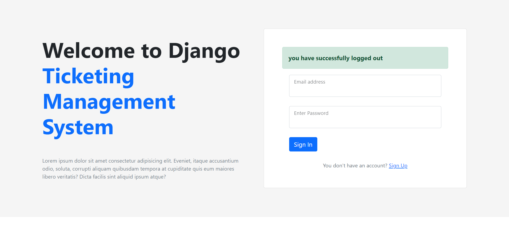
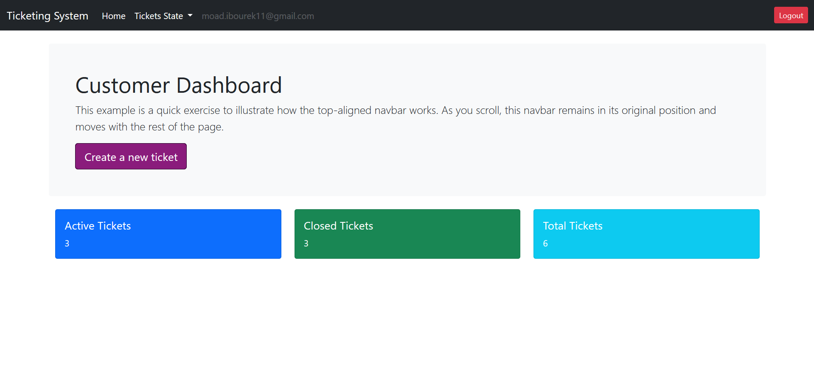
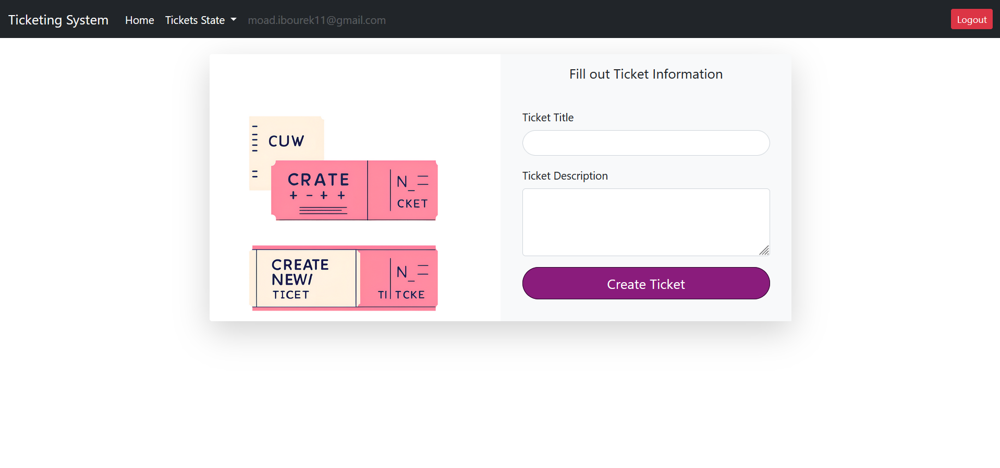
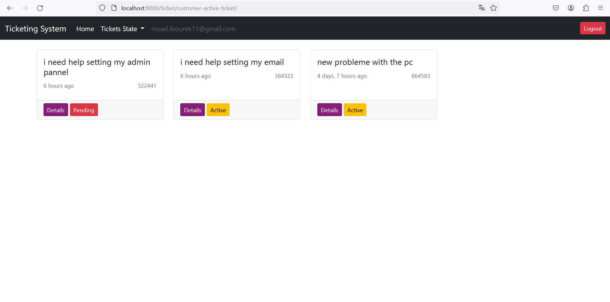
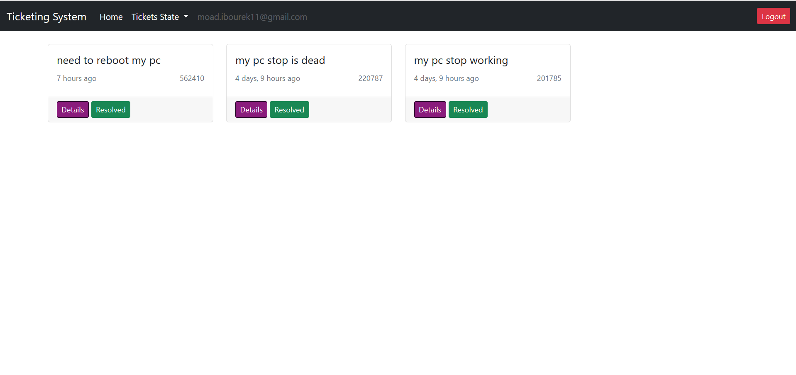

<h1>Ticketing Management System</h1>
<h3>Using Django</h3>

This is my take on the <a href="https://www.youtube.com/@chidiohiri">Chidi Ohiri</a> youtube series

This project allow users to manages ticket from creation to resolving it  
and allow multip types of users admins, engineers, and the customers 

<h5>some screens</h5>

